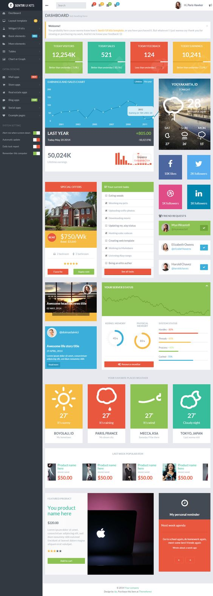
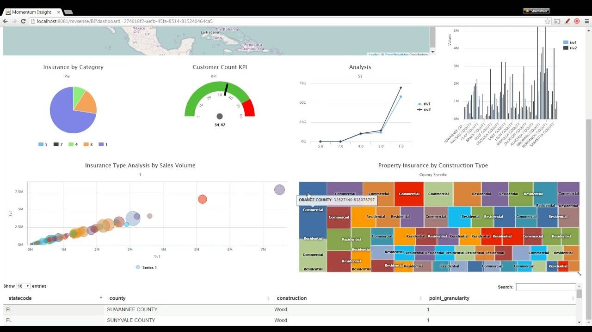
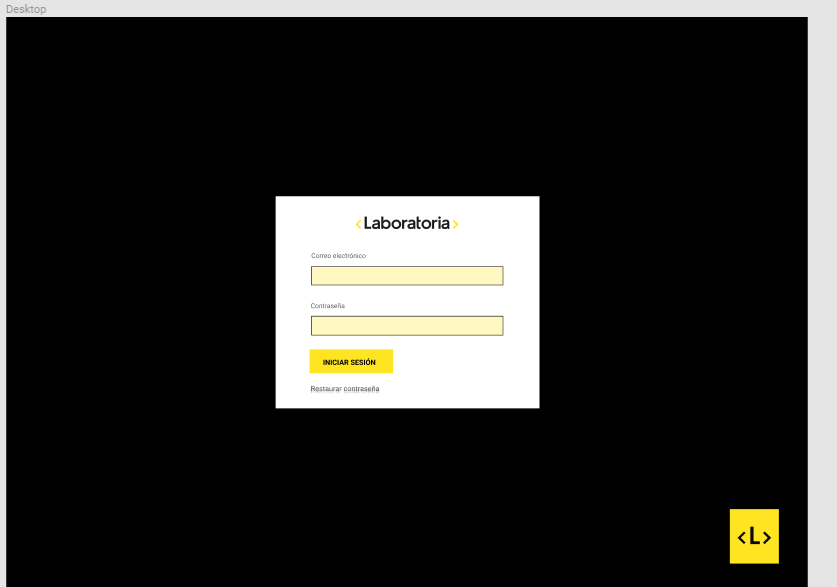
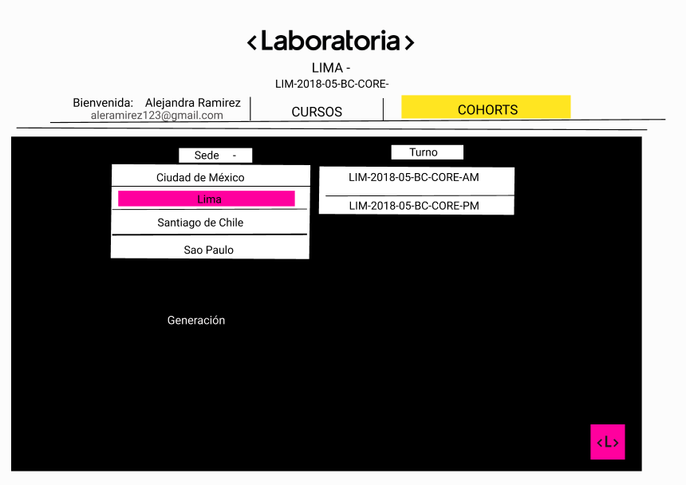
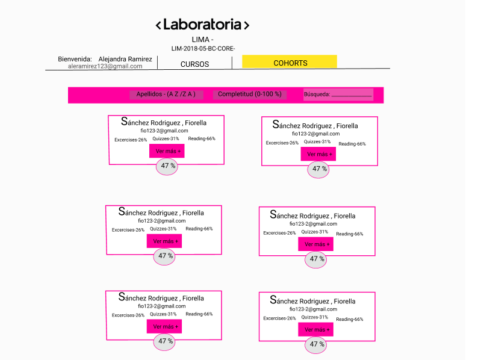

# Data Dashboard

## Preámbulo

En Laboratoria, las Training Managers (TMs) hacen un gran trabajo al analizar la
mayor cantidad de datos posibles respecto al progreso de las estudiantes para
apoyarlas en su aprendizaje.

La principal medida de progreso de una estudiante en Laboratoria es su avance
completando los proyectos de la [Ruta de Aprendizaje](https://docs.google.com/spreadsheets/d/1AoXQjZnZ5MTPwJPNEGDyvn5vksiOUoPr932TjAldTE4/edit#gid=536983970)
y su desempeño en función a la [Rúbrica de Niveles Esperados](https://docs.google.com/spreadsheets/d/e/2PACX-1vSkQy1waRpQ-16sn7VogiDTy-Fz5e7OSZSYUCiHC_bkLAKYewr4L8pWJ_BG210PeULe-TjLScNQQT_x/pubhtml).
Sin embargo, para completar estos proyectos las estudiantes acceden a contenidos
de aprendizaje (lecturas, videos, ejercicios y quizzes) en un sistema que
llamamos LMS (Learning Management System). El LMS acumula data sobre quién
leyó qué, qué ejercicios se han completado, los resultados de los quizzes, etc.

A pesar de que la data de progreso del LMS (ej. lecturas leídas, ejercicios
  completados, nota en quizzes, etc.) no impacta directamente en la evaluación
  de una estudiante, sí es una pieza de información relevante que las TMs
  quisieran visualizar para tener un mejor entendimiento de cómo va cada
  estudiante en su proceso de aprendizaje.

Así, el reto de este proyecto es crear una interfaz donde las TMs puedan
_ver_ y _usar_ la data de progreso del LMS. Para ello, proponemos crear un
**data dashboard** (_tablero de visualización de datos_).

## Definición de producto

¿Quiénes son los principales usuarios de producto?
-Este proyecto está dirigido para lxs Training Mannager (las que tienen a cargo la información de postulantes-estudiantes en general)
-Para definir en definitiva el usuario para este proyecto, se mencionarían a todos aquellos que pueden acceder a toda la "data" de postulantes -estudiantes,información de cursos,etc.

¿Cuáles son los objetivos de estos usuarios en relación con el producto?
-Poder visualizar información real y trascendente de las estudiantes de Laboratoria, contar con una herramienta útil y práctica donde puedan acceder con alguna cuenta.

¿Cuáles son los datos más relevantes que quieren ver en la interfaz.  ¿Cómo los descubriste?
-Esta información se obtuvo mediante la primera entrevista a la Training Mannager - (Usuario), ella nos comentó que hay mucha información por mostrar,sin embargo ella y el equipo determinan que la info general,ejercicios,lecturas y quizzes es lo más importantes ya que técnicamente se está haciendo referencia de la data del Pre-trabajo( una de las etapas de selección)

¿Cuándo revisan normalmente estos datos los usuarios?
-Se podría mencionar que los usuarios ven esta información todas las semanas .

¿Cómo crees que el producto les está resolviendo sus problemas?
-Los usuarios tienen la herramienta cuando ellos gusten, pueden ingresar en cualquier momento del día y visualizan los datos que se mencionan en la anterior pregunta.

**Proceso de diseño:
+El proceso tiene una larga historia,con buenos resultados al fin y al cabo y con un aprendizaje que perdurará por mucho tiempo.

Para comenzar con este proyecto, se hizo una búsqueda de lo que significa datadashoard  y saber lo que nos están solicitando .

Búsqueda adicional :
-
Se encontró esta información:

-Aquí se visualiza un datadashboard completo con data real y gráficos.

-Otro ejemplo: 

## Diseño de la Interfaz de Usuario (prototipo de alta fidelidad)

Nuestro ideal para el proyecto :

-Para realizar un prototipo de alta fidelidad , se utiliza Figma https://www.figma.com 
(herramienta práctica y usable para poder realizar prototipos, opción hasta de crear interfaces)

-Pensamos en el color rosa y negro para poder "jugar" con lo no cotidiano .
resultado:

Este ideal fue pensando en contrastes,  el color negro junto al rosado hace un alto contraste en la segunda vista . 
Luego,en la 3ra vista se quiere colocar blanco para que pueda visualizarse mejor toda la información.

-Requerimientos para este proyecto:

+Extraer la data a través del archivo Json que nos proporionan,luego  mostrarla en la estructura HTML(pantalla)
  ( para esto se utiliza uno de los métodos llamado "XHR")

+Filtrar a cada usuaria colocando la letra que se desee ( si se encuentra en la data)

 Según read-me
+Permitir al usuario seleccionar un cohort de una lista de cohorts.
+Al seleccionar un cohort:
  Listar las estudiantes de ese cohort
  Para cada estudiante:
  Calcular porcentaje de completitud de todos los cursos.
  Calcular grado de completitud de lecturas, ejercicios autocorregidos, y quizzes. Ordenar estudiantes por completitud general (porcentaje consumido/completado de todos los cursos del cohort en cuestión), de lecturas, ejercicios autocorregidos y quizzes.
+Filtrar/buscar estudiantes por nombre.
+Visualizarse sin problemas desde distintos tamaños de pantallas: móviles, tablets y desktops.
+Incluir pruebas unitarias.

El proceso ,como mencioné tiene toda una historia ya que el resultado es completamente diferente.por ahora. 

Aquí se quiere mostrar y expresar que no solamente las cuatro funciones requeridas ,la data de usuarias con su progreso correspondiente  se muestran en la pantalla; lo interno de todo este tema es más lo aprendido ,se puede decir que lo fundamental es saber llamar bien a cada variable para que se reconozca bien cada petición que se solicite.
Se realizó este proyecto con diversas historias cada día conforme se iba avanzando y la última semana fue la definitiva ya que se pudo avanzar enfocándose lo que pide el read-me realmente.

Este proyecto no ha culminado,será mejorado con el pasar de los días hasta poder llegar a visualizar un gáfico tal como un DATADASHBOARD.

Gracias-

